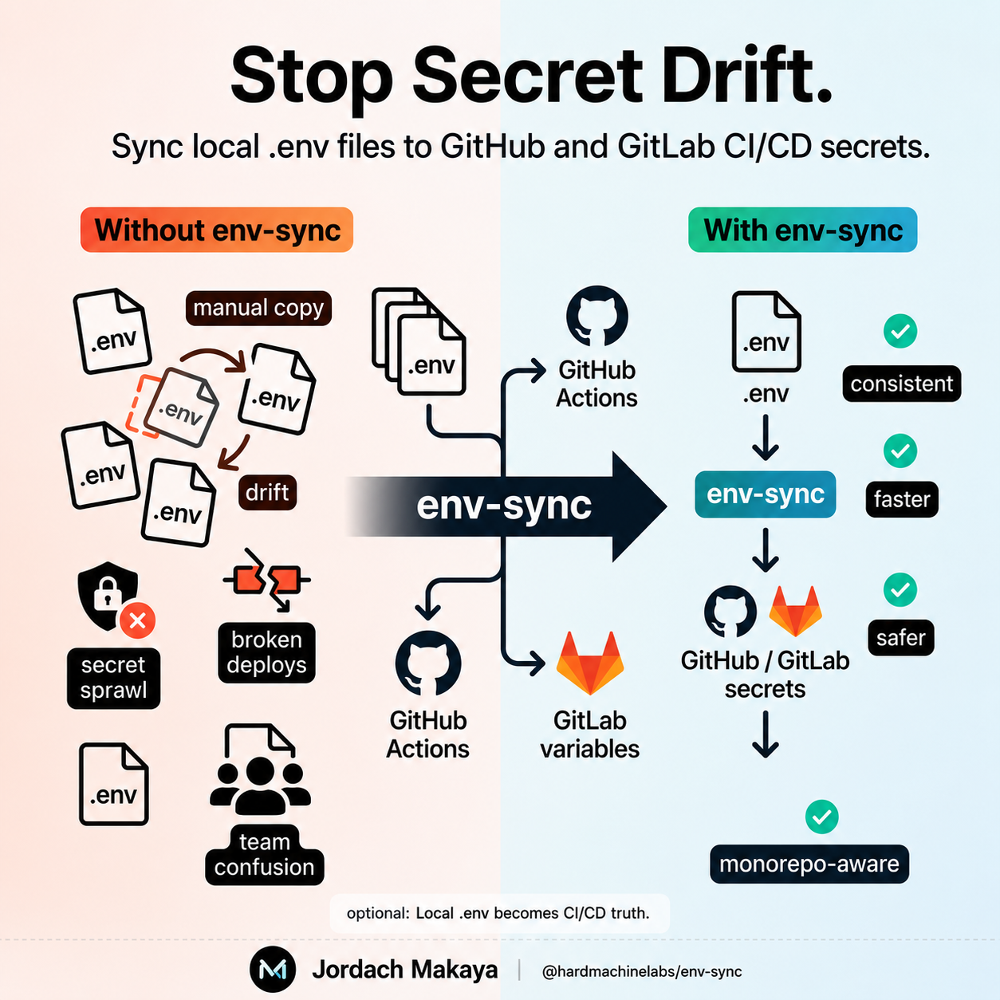

# env-sync



[](https://github.com/jordachmakaya/env-sync/actions/workflows/ci.yml)
[](https://github.com/jordachmakaya/env-sync/actions/workflows/pages.yml)
[](https://www.npmjs.com/package/@hardmachinelabs/env-sync)
[](https://www.npmjs.com/package/@hardmachinelabs/env-sync)
[](packages/env-sync/LICENSE)
[](packages/env-sync/tsconfig.json)
[](packages/env-sync/package.json)


Sync `.env` files to GitHub Actions secrets and GitLab CI/CD variables.

env-sync works for both simple projects and monorepos. It is monorepo-aware, not monorepo-only.

## Links

- Documentation: https://jordachmakaya.github.io/env-sync/
- npm package: https://www.npmjs.com/package/@hardmachinelabs/env-sync
- Repository: https://github.com/jordachmakaya/env-sync

## Quick examples

```bash
pnpm add -D @hardmachinelabs/env-sync
env-sync --provider=github --env=production --dry-run
```

>[!important]
>### Safety
>Run --dry-run first, review generated secret names, and never commit real .env files.
